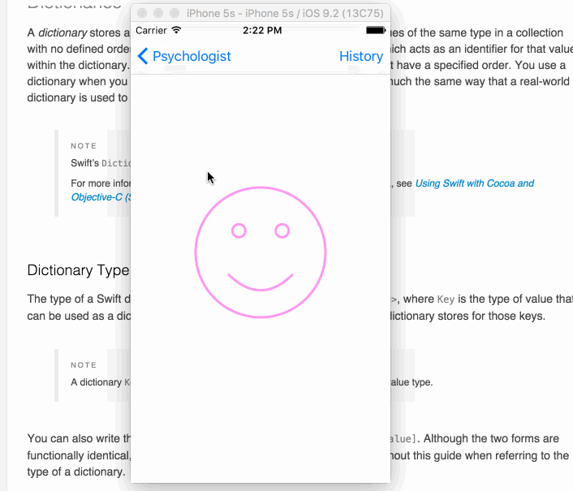

#Psychologist Demo

##What is this?
This is an extension to the [happiness demo](https://github.com/Ugghhh/cs193p-smiley-demo).  
Basically the demo for Lecture 7 where multiple MVCs are discussed.  The happiness MVC is now attached to the Psychologist MVC where an answer to a posed question would change the smiley face in the happiness MVC.  The history of the happiness is kept track of in a popover.

##Main things learned for me
  * Segues can be done with both ctrl+drag and also in code.
    * In code: `prepareSegueWithIdentifier`
  * Segues are prepared for with 	`prepareForSegue` -- allows view to be modified with respect to app state.
    * Tricky thing here: during preparation the view has not yet been instantiate so functions that try to use it beforehand must optional-chain it.
    * When you segue, the resulting MVC is brand-new (as when you remove it from top of stack by going back the MVC no longer exists).
  * The diagnosis history is not related to Happiness MVC as the Happiness MVC's job is mostly only to show the face.  Solution: subclass `HappinessViewController` to `DiagnosedHappinessViewController` to call out the history (`TextViewController`).  This is very common, apparently, to subclass an MVC into multiple various MVCs as not to dirty up the main MVC and is good for maintainability.  For example, `HappinessViewController` is a 3rd-party API or just something that should not be touched at all.
  * `didSet` is called on an overwritten variable even when its corresponding superclass variable is called.  This is nice as it allows for subclasses to tack on actions and just leech off of the superclass.
  * Since segueing creates a brand-new MVC, persistent app data is kept in `NSUserDefaults.standardUserDefaults()`
    * Set an object with `setObject` along with a corresponding key
    * Get it back with `objectForKey`
  * Popovers automatically adapt for phone form-factor.  If a phone is too small (old-style iPhones, the popover is in fact a modal and becomes ugly since you cannot escape a modal MVC so easily from the UI).
    * Solution: override the popover's delegate and implement `adaptivePresentationStyleForPresentationController` and basically tell the system not to adapt to form-factor.
  * Customization of popover sizing can be done with:
    * `sizeThatFits` -- just a method to see how much space an element is taking
    * This will call `presentingViewController` which basically is not nil when the particular MVC is top of stack.

##Demo
